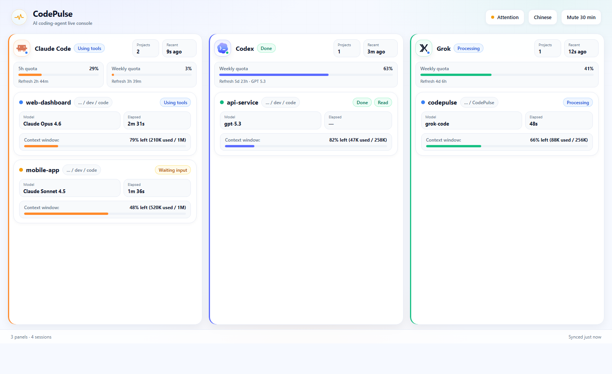
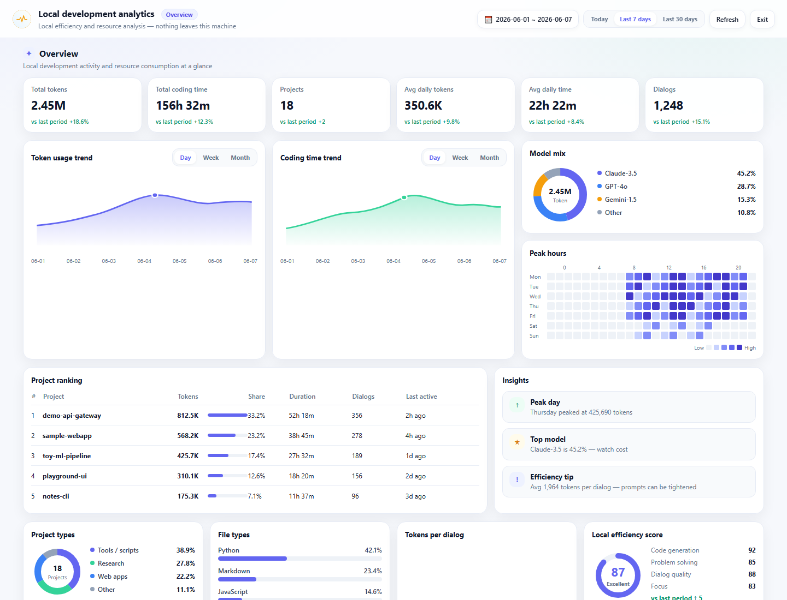

<div align="center">

# CodePulse

**A local status hub for your AI coding agents.**

Know at a glance whether Codex, Claude Code, and Grok are working, waiting on
you, finished, or stuck — without alt-tabbing back to a terminal.

[](#features)
[](#download)
[](https://github.com/noeigenstate/CodePulse/actions/workflows/release.yml)
[](#development)
[](#development)
[](#how-it-works)
[](./LICENSE)

[English](./README.md) · [简体中文](./README.zh-CN.md) · [Product spec](./requirements.md)

</div>

---

AI coding agents are great at working unattended — and terrible at telling you
when they need you. CodePulse listens to the lifecycle hooks that Codex, Claude
Code, and Grok Build already expose, runs every event through a single state
machine, and surfaces the result three ways:

- 📊 **Live Dashboard** — light adaptive panes for Claude Code / Codex / Grok
  (only the CLIs you are using), with brand colors, project cards, context bars,
  and quota meters.
- 📈 **Local analytics console** — open **Insights** (Chinese UI: **后台**) for
  full-screen rollups of tokens, coding time, projects, model mix, and peak hours
  from your local SQLite history; refresh anytime.
- 🎨 **Color-coded tray icon** — the overall state of every agent, visible at
  all times.
- 🔔 **Desktop notifications** — project-first completion toasts with a short
  summary of your prompt (≤15 Chinese characters / ≤15 English words), throttled
  and deduplicated.

Everything runs **100% locally**. The server binds to loopback only, prompts
are stored as short previews (never in full), and the hooks fail silently when
CodePulse isn't running — your agents are never blocked or slowed down.

## Screenshots

### Live console

<p align="center">
  
</p>

Adaptive three-pane console: Claude keeps **5h + weekly** quota meters; Codex
and Grok show **weekly only**. Each project card surfaces model, elapsed time,
context window, and state badges. Open **Insights** for local analytics.
_(Sample data shown.)_

### Local analytics console

<p align="center">
  
</p>

SQLite-backed rollups of tokens, coding time, project ranking, model mix, and
peak hours — today / 7d / 30d with day / week / month trends. Local only,
nothing is uploaded. _(Sample data shown.)_

## Features

|                                     |                                                                                                                                         |
| ----------------------------------- | --------------------------------------------------------------------------------------------------------------------------------------- |
| 🚦 **Unified state machine**        | One turn lifecycle for every agent: idle → processing → tool running → waiting for permission/input → done / error / cancelled / stuck. |
| 🧭 **Multi-agent, multi-workspace** | Concurrent Codex, Claude Code, and Grok sessions across projects, each tracked separately.                                              |
| 🪟 **Adaptive panes**               | Dashboard columns appear only for CLIs that have active tasks (or retained quota) — one CLI, one pane; all three, three panes.          |
| 🎨 **Light design system**          | Brand-accented agent panels, 6px progress meters, status chips, and a compact footer strip for pane/session sync status.                |
| 📈 **Context tracking**             | Compact context-window usage from Claude, Codex, and Grok, using exact CLI data when available.                                         |
| 🎟️ **Quota awareness**              | Claude: 5-hour + weekly windows. Codex / Grok: weekly window only, matched to the model/bucket when the CLI reports it.                 |
| 🔔 **Glanceable toasts**            | Completion title is the project name; body is a cleaned prompt summary — no CLI branding noise.                                         |
| 🕰️ **Stuck detection**              | A watchdog flags turns with no activity so silent failures don't burn your afternoon.                                                   |
| 💾 **Local history**                | Events, sessions, turns, and token snapshots persisted to SQLite — yours to query or delete.                                            |
| 📊 **Local analytics console**      | SQLite rollups of tokens, coding time, projects, and dialogs — today / 7d / 30d, with day / week / month trends.                        |
| 🔌 **Open local API**               | Plain HTTP + WebSocket on `127.0.0.1:17888` for local integrations.                                                                     |

## Local analytics console

The live dashboard answers “what is running now.” The **local analytics console**
answers “how much did I spend over this period.”

1. On the live console, click **Insights** in the top-right (Chinese UI label:
   **后台**).
2. A full-screen analytics view opens. Metrics are aggregated from the on-disk
   `codepulse.sqlite` via in-app IPC — **nothing is uploaded**.
3. Pick **Today / Last 7 days / Last 30 days**, then **Refresh** when you want a
   fresh rollup of the latest events.
4. Trend charts can switch **Day / Week / Month**. Press `Esc` or **Exit** to
   return to the live console.

What you get:

| Section                   | What it shows                                                                                                 |
| ------------------------- | ------------------------------------------------------------------------------------------------------------- |
| **Overview KPIs**         | Total tokens, total / average daily coding time, project count, dialog count, with period-over-period deltas. |
| **Trends**                | Token and coding-time curves so peak days stand out.                                                          |
| **Model mix**             | Share of models in use (Claude / GPT / Gemini, etc.).                                                         |
| **Peak hours**            | Weekday × hour heatmap of activity.                                                                           |
| **Project ranking**       | Per-project tokens, duration, dialogs, and last activity.                                                     |
| **Insights**              | Lightweight tips from local rollups (peak day, top model, efficiency hints).                                  |
| **Distributions & score** | Project types, best-effort file types, tokens-per-dialog buckets, local efficiency score.                     |

> Charts fill in after CLI tasks have been recorded in the local database. A
> fresh install or wiped history will show empty-state hints until you run turns.  
> During active Grok turns, context usage is read from the session’s
> `updates.jsonl`; after a turn ends, `signals.json` is preferred when present.

## How it works

```
 Codex / Claude Code / Grok
   │  lifecycle hooks & status line (dependency-free Node scripts)
   ▼
 POST /api/events ──► adapters ──► StatusHub (pure reducer + rule engine)
 (Fastify, loopback)   normalize        │
                                        ├─► SQLite (events / sessions / turns / tokens / workspaces)
                                        ├─► tray icon update
                                        ├─► desktop notification
                                        └─► WebSocket / IPC push ──► Dashboard (React)
                                                                  └─► Analytics (SQLite rollups)
```

The repository is a `pnpm` workspace:

```
apps/desktop/        Electron app (main / preload / renderer, incl. analytics UI)
packages/
  shared/            Domain types (Agent, Turn, AgentEvent, UsageStats, …) + constants
  core/              State machine, rule engine, aggregation, StatusHub
  adapters/          Codex / Claude / Grok raw payload → AgentEvent mapping
  storage/           SQLite schema (Drizzle ORM), repository, usage-stats queries
  local-server/      Fastify HTTP + WebSocket routes
  hooks/             Standalone hook scripts the agents invoke (incl. usage readers)
scripts/             Backend smoke test
tests/               Unit tests
```

**Stack:** Electron · electron-vite · TypeScript · React · Tailwind · Zustand ·
Fastify · better-sqlite3 · Drizzle ORM.

## Download

Download installers from
[GitHub Releases](https://github.com/noeigenstate/CodePulse/releases):

- **Windows:** `CodePulse_*_x64-setup.exe`
- **macOS Apple Silicon:** `CodePulse_*_mac-arm64.dmg` (M-series)
- **macOS Intel:** `CodePulse_*_mac-x64.dmg`

### macOS first open (unsigned builds)

macOS builds on GitHub Releases are **not code-signed or notarized**. Browsers
(e.g. Chrome) attach a quarantine flag after download. Double-clicking may show:

> “CodePulse” is damaged and can’t be opened. You should move it to the Trash.

The app is **usually not actually damaged** — Gatekeeper is blocking an unsigned,
quarantined app. **System Settings → Privacy & Security → Open Anyway** often does
**not** work for this _damaged_ dialog.

**Recommended fix (Terminal):**

1. Open the DMG and drag `CodePulse.app` into **Applications**.
2. Run (adjust the path if you installed elsewhere):

```bash
xattr -cr /Applications/CodePulse.app
open /Applications/CodePulse.app
```

If the app is still on the mounted DMG volume:

```bash
xattr -cr /Volumes/CodePulse*/CodePulse.app
```

3. Afterwards you can open it from Launchpad or Applications as usual.

Use the DMG that matches your chip (`arm64` vs Intel); the wrong arch will not run.

### macOS: CLIs not detected (Claude / Codex / Grok)

Apps opened from Finder / Launchpad do **not** load your shell `PATH` from
`~/.zshrc`. CLIs installed via Homebrew or nvm may be missing from that minimal
environment, so older builds could report “CLI not detected” even when Terminal
works.

Current builds probe common install locations automatically. If detection still
fails, verify in Terminal:

```bash
which claude codex grok
claude --version
codex --version
grok --version
```

Or point CodePulse at absolute paths and relaunch:

```bash
launchctl setenv CLAUDE_CLI_PATH "$(which claude)"
launchctl setenv CODEX_CLI_PATH "$(which codex)"
launchctl setenv GROK_CLI_PATH "$(which grok)"
```

(Or `export` those variables in a shell and run `open -a CodePulse`.)

## First run

1. Open CodePulse.
2. CodePulse checks your local Claude Code, Codex, and Grok CLI setup.
3. If required entries are missing, CodePulse writes only its own hook and
   status-line configuration to:
   - `~/.claude/settings.json`
   - `~/.codex/hooks.json`
   - `~/.codex/config.toml`
   - `~/.grok/hooks/codepulse.json` (global Grok hooks; trusted by default)
4. If the setup dialog asks you to trust Codex hooks, open a Codex project
   terminal, run `/hooks`, select the CodePulse hook, and trust:
   - `SessionStart`
   - `UserPromptSubmit`
   - `PreToolUse`
   - `PermissionRequest`
   - `PostToolUse`
   - `Stop`
5. Run a Claude Code, Codex, or Grok task. Only panes for CLIs that report
   activity appear on the dashboard (adaptive layout).
6. To review spend over time, open **Insights** in the top-right (see
   [Local analytics console](#local-analytics-console)).

CodePulse only manages CodePulse-owned hook and status-line entries. Existing
user hooks, models, plugins, and preferences are preserved. On uninstall, the
installer removes CodePulse-managed entries automatically.

### Verify

Run any task in Claude Code, Codex, or Grok and watch the matching pane light
up, or check the local API:

```bash
curl http://127.0.0.1:17888/api/health
curl http://127.0.0.1:17888/api/status
```

## Tray states

| Color     | Meaning                                     |
| --------- | ------------------------------------------- |
| ⚪ Grey   | All idle                                    |
| 🔵 Blue   | A task is running                           |
| 🟡 Yellow | Waiting for permission or input — needs you |
| 🟢 Green  | A turn finished, unread                     |
| 🔴 Red    | An error                                    |
| 🟠 Orange | Suspected stuck                             |

Notifications are throttled and deduplicated so you're informed, not nagged.
On completion, the toast title is `{emoji} {project} done` and the body is a
short summary of the user prompt (Chinese ≤15 characters, English ≤15 words).
**Mute** (tray or header button) silences sound for 30 minutes; notifications
still appear, just silently.
Claude Code's routine "waiting for your input" idle reminder is ignored; yellow
means CodePulse saw a real permission or explicit input request.

## Local API

Loopback-only (`127.0.0.1:17888`) — never exposed to the network. Point the
hooks elsewhere with the `CODEPULSE_URL` environment variable.

| Method | Path                 | Purpose                                           |
| ------ | -------------------- | ------------------------------------------------- |
| `POST` | `/api/events`        | Ingest a raw hook payload (or an array, max 1000) |
| `GET`  | `/api/status`        | Full `StatusSnapshot` for the Dashboard           |
| `GET`  | `/api/device/status` | Minimal status for lightweight local clients      |
| `GET`  | `/api/agents/detect` | Detect local Codex / Claude / Grok CLI and hooks  |
| `POST` | `/api/ack/:agent`    | Mark an agent's terminal result as read           |
| `POST` | `/api/mute`          | `{ "muted": true }` to silence notification sound |
| `GET`  | `/api/health`        | Liveness probe                                    |
| `WS`   | `/ws`                | Push channel: `status` + `notification` messages  |

## Data & privacy

CodePulse stores a single SQLite database in the Electron user-data directory:

| OS      | Path                                                       |
| ------- | ---------------------------------------------------------- |
| Windows | `%APPDATA%\CodePulse\codepulse.sqlite`                     |
| macOS   | `~/Library/Application Support/CodePulse/codepulse.sqlite` |
| Linux   | `~/.config/CodePulse/codepulse.sqlite`                     |

It records events, sessions, turns, workspaces, and token snapshots. Raw events
and token snapshots older than 30 days are pruned automatically. Prompts are
stored only as short previews, never in full. Delete the file to reset all
history.

The **local analytics console** only reads this database on-device for rollups.
Usage totals and project paths are never uploaded to a remote server.

## Development

Prerequisites:

- **Node.js ≥ 20** (tested on 22.x)
- **pnpm ≥ 9** — `npm i -g pnpm`

```bash
pnpm install
pnpm dev          # app with hot reload (electron-vite)
pnpm typecheck    # tsc across every package
pnpm test         # unit tests
pnpm smoke        # backend integration test (no Electron, no agent needed)
pnpm lint         # prettier --check
pnpm format       # prettier --write
pnpm db:generate  # generate Drizzle SQL migrations from the schema
```

Workspace packages are consumed from TypeScript **source** (each package's
`exports` points at `src/index.ts`); electron-vite and esbuild bundle the
source directly, so there is no per-package compile step during development.

### Building a distributable

```bash
pnpm build        # build packages, then bundle the app into apps/desktop/out
pnpm dist         # package an installer for the current OS into apps/desktop/release
pnpm dist:win     # Windows NSIS installer (.exe)
pnpm dist:mac     # macOS DMGs: separate arm64 + Intel x64 (not universal)
pnpm dist:mac:arm64
pnpm dist:mac:x64
pnpm dist:dir     # unpacked build (faster, for local testing)
```

`pnpm dist` / `dist:win` / `dist:mac` use the versions in `package.json` and
`apps/desktop/package.json`. Keep them aligned with the release tag. Before
publishing a tag, add or update `docs/release-notes/vX.Y.Z.md`; GitHub Releases
will use that file as the release body. If user-facing behavior changes, update
this README and `README.zh-CN.md` in the same change.

Targets are configured in `apps/desktop/electron-builder.yml` (NSIS on
Windows, DMG on macOS for both Intel and Apple Silicon, AppImage on Linux).
The native `better-sqlite3` addon is unpacked so it loads at runtime; non-runtime
sources and unused Electron locales are excluded from the installer.

macOS CI builds are **unsigned and not notarized**. End users should follow
[macOS first open](#macos-first-open-unsigned-builds) and clear quarantine with
`xattr -cr`. Privacy & Security → “Open Anyway” usually does not help for the
“is damaged” dialog.

### Release workflow

The repository has one GitHub Actions workflow: `Build and Release CodePulse`.

It runs when you push a `v*` tag or start it manually from GitHub Actions. The
workflow builds **Windows** and **macOS** installers in parallel, runs
`typecheck` / `test` / `smoke` / `lint` on each platform job, then publishes a
single GitHub Release with `.exe`, `.dmg`, blockmaps, and release notes.

Release notes come from `docs/release-notes/vX.Y.Z.md`. Keep them short and
user-facing: list what changed, not the internal implementation log.

To publish a version:

```bash
pnpm typecheck && pnpm test && pnpm smoke && pnpm lint
git tag vX.Y.Z
git push origin main vX.Y.Z
```

## Troubleshooting

<details>
<summary><b>macOS says “CodePulse is damaged and can’t be opened”</b></summary>

The package is usually fine. Unsigned builds get a quarantine flag after download,
and Gatekeeper shows a _damaged_ message. Follow
[macOS first open](#macos-first-open-unsigned-builds):

```bash
xattr -cr /Applications/CodePulse.app
open /Applications/CodePulse.app
```

Privacy & Security → Open Anyway usually does **not** work for this dialog. Also
confirm you downloaded the DMG that matches your chip (`mac-arm64` vs `mac-x64`).

</details>

<details>
<summary><b>The Dashboard never leaves "waiting for events"</b></summary>

The agent isn't reaching the server. Check that CodePulse is running, that
`curl http://127.0.0.1:17888/api/health` returns `{"ok":true}`, and that the
setup dialog does not report missing Claude / Codex / Grok hooks. For Codex, run
`/hooks` once and trust the CodePulse hook if prompted. Grok global hooks live in
`~/.grok/hooks/codepulse.json` and do not need project trust.

</details>

<details>
<summary><b>Console logs "SQLite unavailable — running without persistence"</b></summary>

The native `better-sqlite3` build doesn't match your runtime's ABI. The live
Dashboard still works; only history persistence is off. Rebuild for Electron:

```bash
# <ELECTRON_VERSION> = the version in node_modules/electron/package.json
cd node_modules/better-sqlite3
node ../.bin/prebuild-install --runtime electron --target <ELECTRON_VERSION> --arch x64
```

(`electron-builder install-app-deps` does not work under pnpm's hoisted
layout — use the command above.)

</details>

<details>
<summary><b>Port 17888 is already in use</b></summary>

Another instance (or app) holds the port. Quit the other instance from the
tray, or change the port and set `CODEPULSE_URL` for the hooks to match.

</details>

<details>
<summary><b>pnpm install didn't build better-sqlite3 / electron</b></summary>

pnpm 10 blocks dependency build scripts unless allow-listed. They are listed
under `pnpm.onlyBuiltDependencies` in the root `package.json`; run
`pnpm install` again, or `pnpm rebuild`.

</details>

## Contributing

Issues and pull requests are welcome. Before submitting:

1. `pnpm typecheck && pnpm test && pnpm smoke` must pass.
2. Format with `pnpm format`.
3. Keep changes focused — one concern per PR.

For product context, read [`requirements.md`](./requirements.md); the
state-machine transition table in §8 is the source of truth for lifecycle
behavior.

## License

Released under the [MIT License](./LICENSE) © 2026 CodePulse Contributors.
