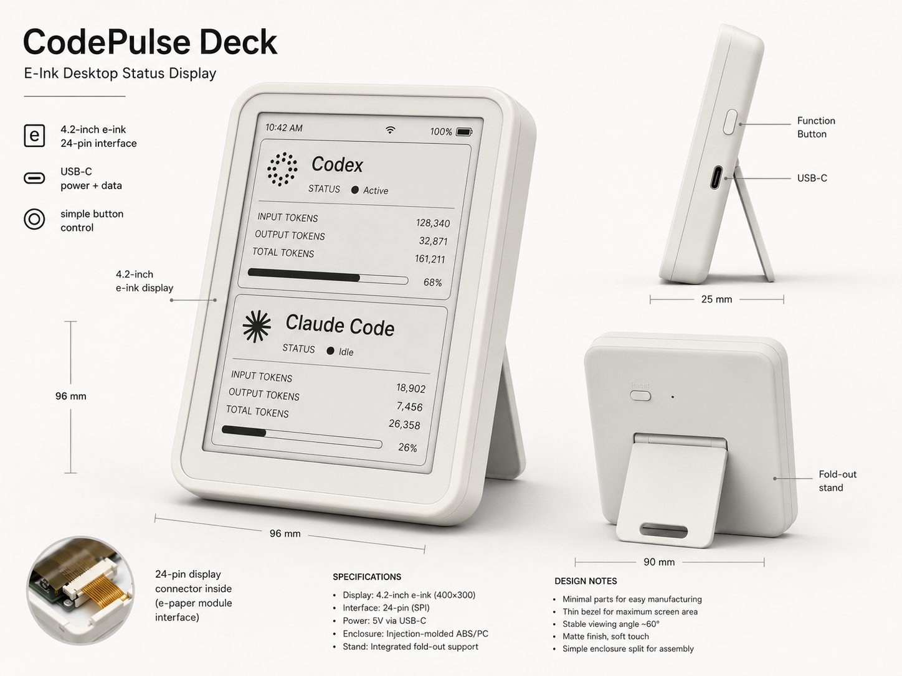

<div align="center">

# CodePulse / 码脉

**面向 AI 编程代理的本地状态中心。**

一眼看清 Codex 与 Claude Code 正在工作、在等你、已完成，还是卡住了——
无需切回终端反复确认。

[](#路线图)
[](#构建可分发版本)
[](#快速开始)
[](#快速开始)
[](#工作原理)
[](./LICENSE)

[English](./README.md) · [简体中文](./README.zh-CN.md) · [产品需求](./requirements.md)

</div>

---

AI 编程代理很擅长无人值守地干活，却很不擅长在需要你时通知你。CodePulse
监听 Codex 与 Claude Code 已经暴露的生命周期 hook，把每一个事件送进同一个
状态机，再用三种方式把结果呈现出来：

- 📊 **实时 Dashboard** —— 按 agent、按工作区的卡片，展示状态、当前活动、
  本轮耗时、工具调用次数、上下文用量与配额。
- 🎨 **彩色托盘图标** —— 所有 agent 的总体状态，随时可见。
- 🔔 **桌面通知** —— 只在真正需要你时才弹出，内置节流与去重。

一切都在 **本地** 运行。服务只绑定回环地址，提示词仅保存短预览（绝不保存全文），
且 CodePulse 未运行时 hook 会静默失败——你的 agent 永远不会被阻塞或拖慢。

## 软件截图


实时 Dashboard 一眼呈现每个 agent 与工作区——状态、模型、本轮耗时、上下文用量，
以及滚动的 5 小时 / 每周额度，全部实时更新。_（图为示意数据。）_

### 🚧 CodePulse Deck —— 硬件伴侣（开发中）

一块专属的 E-Ink 桌面屏，无需开窗即可一眼同步 agent 状态。硬件**目前正在开发中**，
以下为概念渲染：

<div align="center">

</div>

## 功能特性

|                            |                                                                                                         |
| -------------------------- | ------------------------------------------------------------------------------------------------------- |
| 🚦 **统一状态机**          | 所有 agent 共用一套轮次生命周期：空闲 → 处理中 → 执行工具 → 等待授权/输入 → 完成 / 出错 / 取消 / 卡住。 |
| 🧭 **多 agent、多工作区**  | 跨项目并发的 Codex 与 Claude Code 会话，各自独立追踪。                                                  |
| 📈 **上下文与 token 追踪** | 上下文用量来自 Claude 的 status line（精确）与 Codex 的 rollout 文件（估算），并在可得时显示成本。      |
| 🎟️ **配额感知**            | 按配额桶展示 5 小时 / 每周的额度窗口，并与你实际运行的模型匹配。                                        |
| 🕰️ **卡住检测**            | 看门狗会标记长时间无活动的轮次，让静默失败不再白白浪费时间。                                            |
| 💾 **本地历史**            | 事件、会话、轮次与 token 快照持久化到 SQLite——数据归你所有，可查可删。                                  |
| 🔌 **开放本地 API**        | `127.0.0.1:17888` 上的纯 HTTP + WebSocket；可自行构建消费端（ESP32 硬件端已在路线图中）。               |

## 工作原理

```
 Codex / Claude Code
   │  生命周期 hook 与 status line（零依赖 Node 脚本）
   ▼
 POST /api/events ──► 适配器 ──► StatusHub（纯 reducer + 规则引擎）
 （Fastify，回环）     归一化         │
                                     ├─► SQLite（事件 / 会话 / 轮次 / token）
                                     ├─► 托盘图标更新
                                     ├─► 桌面通知
                                     └─► WebSocket / IPC 推送 ──► Dashboard（React）
```

仓库是一个 `pnpm` workspace：

```
apps/desktop/        Electron 应用（main / preload / renderer）
packages/
  shared/            领域类型（Agent、Turn、AgentEvent…）与常量
  core/              状态机、规则引擎、聚合、StatusHub
  adapters/          Codex / Claude 原始 payload → AgentEvent 映射
  storage/           SQLite schema（Drizzle ORM）与仓储
  local-server/      Fastify HTTP + WebSocket 路由
  hooks/             agent 调用的独立 hook 脚本
scripts/             后端冒烟测试
tests/               单元测试
```

**技术栈：** Electron · electron-vite · TypeScript · React · Tailwind · Zustand ·
Fastify · better-sqlite3 · Drizzle ORM。

## 快速开始

### 环境要求

- **Node.js ≥ 20**（在 22.x 上测试）
- **pnpm ≥ 9** —— `npm i -g pnpm`
- Windows 用户：`better-sqlite3` 通常会安装预编译二进制；若数据库加载失败，
  参见[故障排查](#故障排查)。

### 安装与启动

```bash
pnpm install
pnpm dev
```

你会得到一个托盘图标（灰色 = 空闲）、Dashboard 窗口，以及一个运行在
`http://127.0.0.1:17888` 的本地服务。关闭窗口不会退出，CodePulse 会留在托盘里；
从托盘菜单退出即可。

### 接入 Claude Code

`packages/hooks/bin/` 下的 hook 脚本零依赖、且**无论如何都以 0 退出**，因此绝不会
阻塞或破坏 agent。把 `<REPO>` 替换为本仓库的绝对路径（Windows 下使用双反斜杠）。

把下面内容合并进 `~/.claude/settings.json`：

<details>
<summary><code>~/.claude/settings.json</code>（点击展开）</summary>

```jsonc
{
  "hooks": {
    "SessionStart": [
      {
        "hooks": [
          { "type": "command", "command": "node <REPO>/packages/hooks/bin/claude-hook.js" },
        ],
      },
    ],
    "UserPromptSubmit": [
      {
        "hooks": [
          { "type": "command", "command": "node <REPO>/packages/hooks/bin/claude-hook.js" },
        ],
      },
    ],
    "PreToolUse": [
      {
        "hooks": [
          { "type": "command", "command": "node <REPO>/packages/hooks/bin/claude-hook.js" },
        ],
      },
    ],
    "PostToolUse": [
      {
        "hooks": [
          { "type": "command", "command": "node <REPO>/packages/hooks/bin/claude-hook.js" },
        ],
      },
    ],
    "Notification": [
      {
        "hooks": [
          { "type": "command", "command": "node <REPO>/packages/hooks/bin/claude-hook.js" },
        ],
      },
    ],
    "Stop": [
      {
        "hooks": [
          { "type": "command", "command": "node <REPO>/packages/hooks/bin/claude-hook.js" },
        ],
      },
    ],
    "SessionEnd": [
      {
        "hooks": [
          { "type": "command", "command": "node <REPO>/packages/hooks/bin/claude-hook.js" },
        ],
      },
    ],
  },
  "statusLine": {
    "type": "command",
    "command": "node <REPO>/packages/hooks/bin/claude-statusline.js",
  },
}
```

</details>

hook 上报生命周期事件；status line 既把 token / 上下文 / 成本数据转发给
CodePulse，又为 Claude 打印一行紧凑状态（例如 `⏺ Claude Sonnet · my-project · ctx 68%`）。

### 接入 Codex

把 command hook 加入 `~/.codex/hooks.json`：

<details>
<summary><code>~/.codex/hooks.json</code>（点击展开）</summary>

```jsonc
{
  "hooks": {
    "SessionStart": [
      {
        "hooks": [{ "type": "command", "command": "node <REPO>/packages/hooks/bin/codex-hook.js" }],
      },
    ],
    "UserPromptSubmit": [
      {
        "hooks": [{ "type": "command", "command": "node <REPO>/packages/hooks/bin/codex-hook.js" }],
      },
    ],
    "PreToolUse": [
      {
        "matcher": "*",
        "hooks": [{ "type": "command", "command": "node <REPO>/packages/hooks/bin/codex-hook.js" }],
      },
    ],
    "PermissionRequest": [
      {
        "matcher": "*",
        "hooks": [{ "type": "command", "command": "node <REPO>/packages/hooks/bin/codex-hook.js" }],
      },
    ],
    "PostToolUse": [
      {
        "matcher": "*",
        "hooks": [{ "type": "command", "command": "node <REPO>/packages/hooks/bin/codex-hook.js" }],
      },
    ],
    "Stop": [
      {
        "hooks": [{ "type": "command", "command": "node <REPO>/packages/hooks/bin/codex-hook.js" }],
      },
    ],
  },
}
```

</details>

当前 Codex 构建默认启用 hooks；如果你曾关闭，可在 `~/.codex/config.toml` 的
`[features]` 下用 `hooks = true` 重新启用。添加或修改 hook 后，在 Codex 中运行
`/hooks` 审核并信任它。

> Codex 没有 status line，因此 hook 脚本会尽力从 Codex 本地的 rollout 文件读取
> token 用量与配额（`accuracy: estimated`）。

### 验证

在任一 agent 中跑一次任务，观察 Dashboard 亮起——也可以发送一个合成事件：

```bash
curl -X POST http://127.0.0.1:17888/api/events \
  -H "content-type: application/json" \
  -d '{"source":"claude_code","hook_event_name":"UserPromptSubmit","session_id":"demo","cwd":"/tmp/demo","prompt":"hello"}'

curl http://127.0.0.1:17888/api/status
```

## 托盘状态

| 颜色  | 含义                       |
| ----- | -------------------------- |
| ⚪ 灰 | 全部空闲                   |
| 🔵 蓝 | 有任务正在运行             |
| 🟡 黄 | 等待授权或输入——需要你介入 |
| 🟢 绿 | 一轮任务已完成、未读       |
| 🔴 红 | 出错                       |
| 🟠 橙 | 疑似卡住                   |

通知经过节流与去重，确保你被告知、而不是被骚扰。**静音**（托盘或顶栏按钮）会让
声音静默 30 分钟；通知仍会出现，只是没有声音。

## 本地 API

仅回环（`127.0.0.1:17888`）——绝不暴露到网络。用环境变量 `CODEPULSE_URL` 可让 hook
指向其他地址。

| 方法   | 路径                 | 用途                                       |
| ------ | -------------------- | ------------------------------------------ |
| `POST` | `/api/events`        | 接收原始 hook payload（或数组，最多 1000） |
| `GET`  | `/api/status`        | Dashboard 使用的完整 `StatusSnapshot`      |
| `GET`  | `/api/device/status` | 硬件端使用的精简状态                       |
| `GET`  | `/api/agents/detect` | 检测本地 Codex / Claude CLI 与 hook 配置   |
| `POST` | `/api/ack/:agent`    | 把某个 agent 的终结结果标记为已读          |
| `POST` | `/api/mute`          | `{ "muted": true }` 静音通知声音           |
| `GET`  | `/api/health`        | 存活探针                                   |
| `WS`   | `/ws`                | 推送通道：`status` + `notification` 消息   |

## 数据与隐私

CodePulse 把单个 SQLite 数据库存放在 Electron 的 user-data 目录：

| 操作系统 | 路径                                                       |
| -------- | ---------------------------------------------------------- |
| Windows  | `%APPDATA%\CodePulse\codepulse.sqlite`                     |
| macOS    | `~/Library/Application Support/CodePulse/codepulse.sqlite` |
| Linux    | `~/.config/CodePulse/codepulse.sqlite`                     |

它记录事件、会话、轮次与 token 快照。提示词只保存短预览，绝不保存全文。删除该文件即可
重置全部历史。

## 开发

```bash
pnpm dev          # 带热重载的应用（electron-vite）
pnpm typecheck    # 对每个包运行 tsc
pnpm test         # 单元测试
pnpm smoke        # 后端集成测试（无需 Electron、无需 agent）
pnpm lint         # prettier --check
pnpm format       # prettier --write
pnpm db:generate  # 从 schema 生成 Drizzle SQL 迁移
```

workspace 内的包以 TypeScript **源码** 形式被消费（每个包的 `exports` 指向
`src/index.ts`）；electron-vite 与 esbuild 直接打包源码，因此开发期没有逐包编译步骤。

### 构建可分发版本

```bash
pnpm build        # 构建各包，再把应用打包进 apps/desktop/out
pnpm dist         # 把安装包打到 apps/desktop/release
pnpm dist:dir     # 免安装目录（更快，便于本地测试）
```

打包目标在 `apps/desktop/electron-builder.yml` 中配置（Windows 用 NSIS、macOS 用 DMG、
Linux 用 AppImage）。原生模块 `better-sqlite3` 被保留在 asar 归档之外，以便运行时加载。

## 故障排查

<details>
<summary><b>Dashboard 一直停在“正在等待事件”</b></summary>

说明 agent 没有触达服务。请检查：settings 中的 hook 路径是绝对且正确的、CodePulse
正在运行、`curl http://127.0.0.1:17888/api/health` 返回 `{"ok":true}`。若你改了端口，
记得给 hook 设置 `CODEPULSE_URL`。

</details>

<details>
<summary><b>控制台输出“SQLite unavailable — running without persistence”</b></summary>

原生 `better-sqlite3` 的构建与运行时 ABI 不匹配。实时 Dashboard 仍可用，只是关闭了历史
持久化。为 Electron 重新构建：

```bash
# <ELECTRON_VERSION> = node_modules/electron/package.json 中的版本号
cd node_modules/better-sqlite3
node ../.bin/prebuild-install --runtime electron --target <ELECTRON_VERSION> --arch x64
```

（在 pnpm 的提升式布局下 `electron-builder install-app-deps` 不起作用——请用上面的命令。）

</details>

<details>
<summary><b>端口 17888 已被占用</b></summary>

另一个实例（或应用）占用了该端口。从托盘退出另一个实例，或改用其他端口并给 hook 设置
对应的 `CODEPULSE_URL`。

</details>

<details>
<summary><b>pnpm install 没有构建 better-sqlite3 / electron</b></summary>

pnpm 10 默认会拦截依赖的构建脚本，除非加入允许清单。它们已列在根 `package.json` 的
`pnpm.onlyBuiltDependencies` 下；重新运行 `pnpm install`，或执行 `pnpm rebuild`。

</details>

## 路线图

**v0.1（当前）** 端到端交付了完整的本地链路：事件接收、统一状态机、带节流的规则引擎、
SQLite 持久化、托盘、桌面通知、实时 Dashboard 与设备状态 API。

计划中的下一步（见 [`requirements.md`](./requirements.md) §12）：

- [ ] 设置界面与一键安装 hook
- [ ] ESP32 硬件状态显示客户端
- [ ] 精确的 Codex token 统计
- [ ] 云端同步与账号

上文展示的 **CodePulse Deck** E-Ink 硬件伴侣即属于本路线图，目前正在开发中。

## 贡献

欢迎提交 issue 与 pull request。提交前请确保：

1. `pnpm typecheck && pnpm test && pnpm smoke` 全部通过。
2. 用 `pnpm format` 格式化。
3. 保持改动聚焦——一个 PR 只做一件事。

产品背景请阅读 [`requirements.md`](./requirements.md)；其中 §8 的状态机迁移表是生命周期
行为的权威依据。

## 许可证

基于 [MIT 许可证](./LICENSE) 发布 © 2026 CodePulse Contributors。
