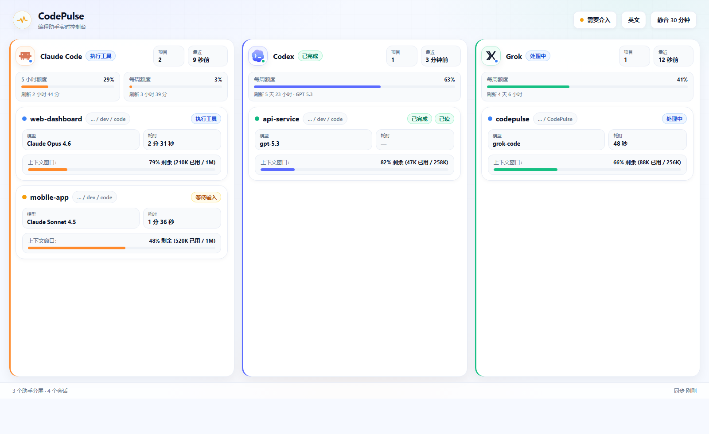
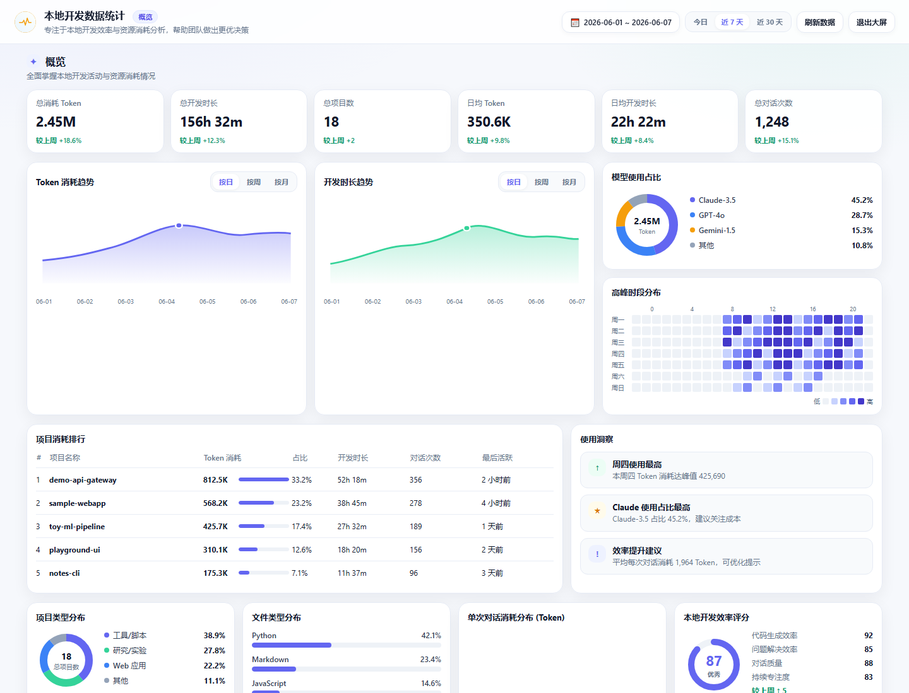

<div align="center">

# CodePulse / 码脉

**面向 AI 编程代理的本地状态中心。**

一眼看清 Codex、Claude Code 与 Grok 正在工作、在等你、已完成，还是卡住了——
无需切回终端反复确认。

[](#功能特性)
[](#下载)
[](https://github.com/noeigenstate/CodePulse/actions/workflows/release.yml)
[](#开发)
[](#开发)
[](#工作原理)
[](./LICENSE)

[English](./README.md) · [简体中文](./README.zh-CN.md) · [产品需求](./requirements.md)

</div>

---

AI 编程代理很擅长无人值守地干活，却不擅长在需要你时通知你。CodePulse
监听 Codex、Claude Code 与 Grok Build 已经暴露的生命周期 hook，把每一个事件
送进同一个状态机，再用三种方式把结果呈现出来：

- 📊 **实时 Dashboard** —— 浅色自适应分屏（Claude Code / Codex / Grok，
  只用到的 CLI 才出栏），品牌色面板、项目卡片、上下文与额度进度一目了然。
- 📈 **本地统计后台** —— 右上角「后台」进入全屏分析：Token、时长、项目排行、
  模型占比与高峰时段，全部从本机 SQLite 汇总，可随时刷新同步。
- 🎨 **彩色托盘图标** —— 所有 agent 的总体状态，随时可见。
- 🔔 **桌面通知** —— 完成时以项目名为标题，正文为用户提问摘要
  （中文 ≤15 字 / 英文 ≤15 词），内置节流与去重。

一切都在 **本地** 运行。服务只绑定回环地址，提示词仅保存短预览（绝不保存全文），
且 CodePulse 未运行时 hook 会静默失败——你的 agent 永远不会被阻塞或拖慢。

## 软件截图

### 实时控制台

<p align="center">
  
</p>

三栏自适应控制台：Claude 显示 **5 小时 + 每周** 额度；Codex / Grok 仅显示 **每周额度**。
项目卡片包含模型、耗时、上下文窗口与状态徽标。右上角 **「后台」** 可进入本地统计。_（图为示意数据。）_

### 本地统计后台

<p align="center">
  
</p>

从本机 SQLite 汇总 Token、开发时长、项目排行、模型占比与高峰时段；支持今日 / 近 7 天 / 近 30 天与按日 / 周 / 月趋势，数据不上传云端。_（图为示意数据。）_

## 功能特性

|                           |                                                                                                         |
| ------------------------- | ------------------------------------------------------------------------------------------------------- |
| 🚦 **统一状态机**         | 所有 agent 共用一套轮次生命周期：空闲 → 处理中 → 执行工具 → 等待授权/输入 → 完成 / 出错 / 取消 / 卡住。 |
| 🧭 **多 agent、多工作区** | 跨项目并发的 Codex、Claude Code 与 Grok 会话，各自独立追踪。                                            |
| 🪟 **自适应分屏**         | 仅在对应 CLI 有任务（或仍保留额度）时显示分栏；只用一个 CLI 时只显示一栏，三个都用则三栏。              |
| 🎨 **浅色设计系统**       | 品牌色分屏、6px 进度条、状态徽标，以及分屏/会话同步信息的底部状态栏。                                   |
| 📈 **上下文追踪**         | 展示 Claude、Codex 与 Grok 的紧凑上下文窗口信息，优先使用 CLI 提供的精确数据。                          |
| 🎟️ **配额感知**           | Claude：5 小时 + 每周；Codex / Grok：仅每周额度，并与 CLI 上报的模型/配额桶匹配。                       |
| 🔔 **一眼可读的通知**     | 完成标题为项目名；正文为清洗后的提问摘要，不夹带 CLI 品牌文案。                                         |
| 🕰️ **卡住检测**           | 看门狗会标记长时间无活动的轮次，让静默失败不再白白浪费时间。                                            |
| 💾 **本地历史**           | 事件、会话、轮次与 token 快照持久化到 SQLite——数据归你所有，可查可删。                                  |
| 📊 **本地统计后台**       | 从 SQLite 汇总 Token / 开发时长 / 项目 / 对话；支持今日、近 7 天、近 30 天与按日/周/月趋势。            |
| 🔌 **开放本地 API**       | `127.0.0.1:17888` 上的纯 HTTP + WebSocket，可用于本地集成。                                             |

## 本地统计后台

实时 Dashboard 回答「现在谁在跑」；**本地统计后台** 回答「这段时间花了多少资源」。

1. 在实时控制台右上角点击 **「后台」**（英文界面为 **Insights**）。
2. 全屏打开统计台，数据来自本机 `codepulse.sqlite`（经应用内 IPC 聚合，**不上传云端**）。
3. 选择 **今日 / 近 7 天 / 近 30 天**，需要时点 **「刷新数据」** 重新汇总最新事件。
4. 趋势图可切换 **按日 / 按周 / 按月**。按 `Esc` 或 **「退出大屏」** 返回实时控制台。

后台主要模块：

| 模块             | 说明                                                                 |
| ---------------- | -------------------------------------------------------------------- |
| **概览 KPI**     | 总消耗 Token、总/日均开发时长、项目数、对话次数，并给出与上期的环比。 |
| **趋势**         | Token 消耗与开发时长曲线，便于发现峰值日。                           |
| **模型占比**     | 各模型用量份额（如 Claude / GPT / Gemini 等）。                      |
| **高峰时段**     | 按星期 × 小时的热力图，看清活跃集中时段。                            |
| **项目消耗排行** | 按项目汇总 Token、时长、对话次数与最近活跃时间。                     |
| **使用洞察**     | 基于本地汇总的轻量提示（峰值日、主力模型、效率建议等）。             |
| **分布与评分**   | 项目类型、文件类型（尽力而为）、单次对话 Token 分桶、本地效率评分。  |

> 有 CLI 任务并成功写入本地库后，后台才会逐步填满；全新安装或刚清理历史时会提示暂无数据。  
> Grok 执行中的上下文占用会优先读活动会话的 `updates.jsonl`，任务结束后以 `signals.json` 为准。

## 工作原理

```
 Codex / Claude Code / Grok
   │  生命周期 hook 与 status line（零依赖 Node 脚本）
   ▼
 POST /api/events ──► 适配器 ──► StatusHub（纯 reducer + 规则引擎）
 （Fastify，回环）     归一化         │
                                     ├─► SQLite（事件 / 会话 / 轮次 / token / 工作区）
                                     ├─► 托盘图标更新
                                     ├─► 桌面通知
                                     └─► WebSocket / IPC 推送 ──► Dashboard（React）
                                                              └─► 统计后台（SQLite 聚合）
```

仓库是一个 `pnpm` workspace：

```
apps/desktop/        Electron 应用（main / preload / renderer，含统计后台 UI）
packages/
  shared/            领域类型（Agent、Turn、AgentEvent、UsageStats…）与常量
  core/              状态机、规则引擎、聚合、StatusHub
  adapters/          Codex / Claude / Grok 原始 payload → AgentEvent 映射
  storage/           SQLite schema（Drizzle ORM）、仓储与用量统计查询
  local-server/      Fastify HTTP + WebSocket 路由
  hooks/             agent 调用的独立 hook 脚本（含 Grok/Codex 用量读取）
scripts/             后端冒烟测试
tests/               单元测试
```

**技术栈：** Electron · electron-vite · TypeScript · React · Tailwind · Zustand ·
Fastify · better-sqlite3 · Drizzle ORM。

## 下载

从 [GitHub Releases](https://github.com/noeigenstate/CodePulse/releases)
下载安装包：

- **Windows：** `CodePulse_*_x64-setup.exe`
- **macOS Apple Silicon：** `CodePulse_*_mac-arm64.dmg`（M 系列芯片）
- **macOS Intel：** `CodePulse_*_mac-x64.dmg`

### macOS 首次打开（未签名构建）

当前 Release 中的 macOS 安装包**未做 Apple 代码签名与公证**。用浏览器（如 Chrome）
下载后，系统会加上隔离标记。双击时可能弹出：

> “CodePulse” is damaged and can’t be opened. You should move it to the Trash.  
> （“CodePulse”已损坏，无法打开。你应该将它移到废纸篓。）

这**通常不是安装包真的损坏**，而是 Gatekeeper 对未签名 + 隔离 App 的拦截文案。
「系统设置 → 隐私与安全性 → 仍要打开」对这种 **damaged** 提示**往往无效**。

**推荐做法（终端）：**

1. 打开 DMG，把 `CodePulse.app` 拖到「应用程序」。
2. 打开「终端」，执行（路径按实际安装位置调整）：

```bash
xattr -cr /Applications/CodePulse.app
open /Applications/CodePulse.app
```

若 App 还在 DMG 卷上，可先对挂载路径执行，例如：

```bash
xattr -cr /Volumes/CodePulse*/CodePulse.app
```

3. 之后可从启动台或「应用程序」正常打开。

请按本机芯片选择对应 DMG（arm64 / Intel），架构不对也会打不开。

### macOS 检测不到 Claude / Codex / Grok 命令行

从「启动台 / Finder」打开的 App **不会加载** 终端里的 `~/.zshrc` PATH。  
CLI 若装在 Homebrew（`/opt/homebrew/bin`）或 nvm/npm 全局目录，旧版可能误报「未检测到命令行工具」。

当前版本会自动探测常见安装路径。若仍检测失败，可在终端确认 CLI 可用：

```bash
which claude codex grok
claude --version
codex --version
grok --version
```

也可设置绝对路径后重启 CodePulse：

```bash
launchctl setenv CLAUDE_CLI_PATH "$(which claude)"
launchctl setenv CODEX_CLI_PATH "$(which codex)"
launchctl setenv GROK_CLI_PATH "$(which grok)"
```

（或在启动 CodePulse 的 shell 中 `export` 上述变量后再 `open -a CodePulse`。）

## 首次运行

1. 打开 CodePulse。
2. CodePulse 会检查本机 Claude Code、Codex 和 Grok CLI 配置。
3. 如果缺少必要项，CodePulse 只会把自己的 hook 与 status line 配置写入：
   - `~/.claude/settings.json`
   - `~/.codex/hooks.json`
   - `~/.codex/config.toml`
   - `~/.grok/hooks/codepulse.json`（Grok 全局 hooks，默认受信任）
4. 如果配置弹窗提示需要信任 Codex hook，打开一个 Codex 项目终端，运行 `/hooks`，
   选择 CodePulse hook，并信任：
   - `SessionStart`
   - `UserPromptSubmit`
   - `PreToolUse`
   - `PermissionRequest`
   - `PostToolUse`
   - `Stop`
5. 运行一轮 Claude Code、Codex 或 Grok 任务。Dashboard 只显示有活动的 CLI
   对应分屏（自适应布局）。
6. 需要复盘消耗时，点右上角 **「后台」** 打开本地统计台（详见
   [本地统计后台](#本地统计后台)）。

CodePulse 只管理 CodePulse 自己的 hook 和 status line 配置。你原有的 hook、模型、
插件和偏好设置会保留。卸载时，安装器会自动删除 CodePulse 管理的配置。

### 验证

在 Claude Code、Codex 或 Grok 中跑一次任务，观察对应分屏亮起；也可以检查本地 API：

```bash
curl http://127.0.0.1:17888/api/health
curl http://127.0.0.1:17888/api/status
```

## 托盘状态

| 颜色  | 含义                       |
| ----- | -------------------------- |
| ⚪ 灰 | 全部空闲                   |
| 🔵 蓝 | 有任务正在运行             |
| 🟡 黄 | 等待授权或输入——需要你介入 |
| 🟢 绿 | 一轮任务已完成、未读       |
| 🔴 红 | 出错                       |
| 🟠 橙 | 疑似卡住                   |

通知经过节流与去重，确保你被告知、而不是被骚扰。完成时标题为
`{emoji} {项目} 已完成`，正文为用户提问摘要（中文 ≤15 字，英文 ≤15 词）。
**静音**（托盘或顶栏按钮）会让声音静默 30 分钟；通知仍会出现，只是没有声音。
Claude Code 常规的“waiting for your input”空闲提醒会被忽略；黄色状态只表示
CodePulse 确认看到了真实授权请求或明确输入请求。

## 本地 API

仅回环（`127.0.0.1:17888`）——绝不暴露到网络。用环境变量 `CODEPULSE_URL` 可让 hook
指向其他地址。

| 方法   | 路径                 | 用途                                       |
| ------ | -------------------- | ------------------------------------------ |
| `POST` | `/api/events`        | 接收原始 hook payload（或数组，最多 1000） |
| `GET`  | `/api/status`        | Dashboard 使用的完整 `StatusSnapshot`      |
| `GET`  | `/api/device/status` | 轻量本地客户端使用的精简状态               |
| `GET`  | `/api/agents/detect` | 检测本地 Codex / Claude / Grok CLI 与 hook |
| `POST` | `/api/ack/:agent`    | 把某个 agent 的终结结果标记为已读          |
| `POST` | `/api/mute`          | `{ "muted": true }` 静音通知声音           |
| `GET`  | `/api/health`        | 存活探针                                   |
| `WS`   | `/ws`                | 推送通道：`status` + `notification` 消息   |

## 数据与隐私

CodePulse 把单个 SQLite 数据库存放在 Electron 的 user-data 目录：

| 操作系统 | 路径                                                       |
| -------- | ---------------------------------------------------------- |
| Windows  | `%APPDATA%\CodePulse\codepulse.sqlite`                     |
| macOS    | `~/Library/Application Support/CodePulse/codepulse.sqlite` |
| Linux    | `~/.config/CodePulse/codepulse.sqlite`                     |

它记录事件、会话、轮次、工作区与 token 快照。30 天前的原始事件与 token 快照会自动清理。
提示词只保存短预览，绝不保存全文。删除该文件即可重置全部历史。

**本地统计后台** 只在本机读取上述数据库做聚合展示，不会把用量或项目路径上传到任何服务器。

## 开发

环境要求：

- **Node.js ≥ 20**（在 22.x 上测试）
- **pnpm ≥ 9** —— `npm i -g pnpm`

```bash
pnpm install
pnpm dev          # 带热重载的应用（electron-vite）
pnpm typecheck    # 对每个包运行 tsc
pnpm test         # 单元测试
pnpm smoke        # 后端集成测试（无需 Electron、无需 agent）
pnpm lint         # prettier --check
pnpm format       # prettier --write
pnpm db:generate  # 从 schema 生成 Drizzle SQL 迁移
```

workspace 内的包以 TypeScript **源码** 形式被消费（每个包的 `exports` 指向
`src/index.ts`）；electron-vite 与 esbuild 直接打包源码，因此开发期没有逐包编译步骤。

### 构建可分发版本

```bash
pnpm build        # 构建各包，再把应用打包进 apps/desktop/out
pnpm dist         # 为当前操作系统打包安装包到 apps/desktop/release
pnpm dist:win     # Windows NSIS 安装包（.exe）
pnpm dist:mac     # macOS DMG：分别打 arm64 与 Intel x64（非 universal）
pnpm dist:mac:arm64
pnpm dist:mac:x64
pnpm dist:dir     # 免安装目录（更快，便于本地测试）
```

`pnpm dist` / `dist:win` / `dist:mac` 使用 `package.json` 与
`apps/desktop/package.json` 里的版本号；发版前必须让它们与 tag 一致。推送 tag 前，
请新增或更新 `docs/release-notes/vX.Y.Z.md`，GitHub Release 会直接使用该文件作为发版说明。
如果用户可见行为发生变化，请在同一次改动里同步更新英文 README 和本中文版。

打包目标在 `apps/desktop/electron-builder.yml` 中配置（Windows 用 NSIS、macOS 用
Intel/Apple Silicon 双架构 DMG、Linux 用 AppImage）。原生模块 `better-sqlite3`
会保留在 asar 归档之外，以便运行时加载；非运行时源码和未使用的 Electron 语言资源会从
安装包中排除。

macOS CI 产物为**未签名、未公证**构建。用户侧请按上文
[macOS 首次打开](#macos-首次打开未签名构建) 用 `xattr -cr` 去除隔离标记；
「隐私与安全性 → 仍要打开」对 “is damaged” 类弹窗通常无效。

### 发版流程

仓库只保留一个 GitHub Actions workflow：`Build and Release CodePulse`。

它会在推送 `v*` tag 或从 GitHub Actions 手动运行时触发。流程会**并行**构建
Windows 与 macOS 安装包，并在各平台任务中执行 `typecheck` / `test` / `smoke` /
`lint`，最后汇总上传 `.exe`、`.dmg`、blockmap 与发版说明，创建或更新 GitHub Release。

发版说明来自 `docs/release-notes/vX.Y.Z.md`。内容保持简短、面向用户：只写这版更新了什么，
不要写内部实现流水账。

发布一个版本：

```bash
pnpm typecheck && pnpm test && pnpm smoke && pnpm lint
git tag vX.Y.Z
git push origin main vX.Y.Z
```

## 故障排查

<details>
<summary><b>macOS 提示 “CodePulse is damaged and can’t be opened”</b></summary>

安装包一般没有损坏。当前 mac 构建未签名，下载后的隔离标记会触发该文案。
请按 [macOS 首次打开](#macos-首次打开未签名构建) 执行：

```bash
xattr -cr /Applications/CodePulse.app
open /Applications/CodePulse.app
```

「系统设置 → 隐私与安全性 → 仍要打开」对这种弹窗通常无效。请确认下载的是
与本机芯片匹配的 DMG（`mac-arm64` / `mac-x64`）。

</details>

<details>
<summary><b>Dashboard 一直停在“正在等待事件”</b></summary>

说明 agent 没有触达服务。请检查 CodePulse 正在运行、
`curl http://127.0.0.1:17888/api/health` 返回 `{"ok":true}`，并且配置弹窗没有提示
Claude / Codex / Grok hook 缺失。Codex 如果提示需要信任，请运行一次 `/hooks` 并信任
CodePulse hook。Grok 全局 hooks 写在 `~/.grok/hooks/codepulse.json`，无需项目级信任。

</details>

<details>
<summary><b>控制台输出“SQLite unavailable — running without persistence”</b></summary>

原生 `better-sqlite3` 的构建与运行时 ABI 不匹配。实时 Dashboard 仍可用，只是关闭了历史
持久化。为 Electron 重新构建：

```bash
# <ELECTRON_VERSION> = node_modules/electron/package.json 中的版本号
cd node_modules/better-sqlite3
node ../.bin/prebuild-install --runtime electron --target <ELECTRON_VERSION> --arch x64
```

（在 pnpm 的提升式布局下 `electron-builder install-app-deps` 不起作用——请用上面的命令。）

</details>

<details>
<summary><b>端口 17888 已被占用</b></summary>

另一个实例（或应用）占用了该端口。从托盘退出另一个实例，或改用其他端口并给 hook 设置
对应的 `CODEPULSE_URL`。

</details>

<details>
<summary><b>pnpm install 没有构建 better-sqlite3 / electron</b></summary>

pnpm 10 默认会拦截依赖的构建脚本，除非加入允许清单。它们已列在根 `package.json` 的
`pnpm.onlyBuiltDependencies` 下；重新运行 `pnpm install`，或执行 `pnpm rebuild`。

</details>

## 贡献

欢迎提交 issue 与 pull request。提交前请确保：

1. `pnpm typecheck && pnpm test && pnpm smoke` 全部通过。
2. 用 `pnpm format` 格式化。
3. 保持改动聚焦——一个 PR 只做一件事。

产品背景请阅读 [`requirements.md`](./requirements.md)；其中 §8 的状态机迁移表是生命周期
行为的权威依据。

## 许可证

基于 [MIT 许可证](./LICENSE) 发布 © 2026 CodePulse Contributors。
